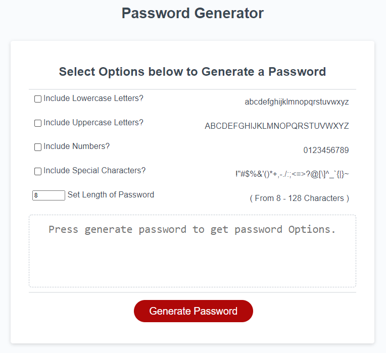

# get_SecurePassword_WebApp

A Web-Based Application the generate a secure password based on user input.

## [Here is a link!](https://erikplachta.github.io/get_SecurePassword_WebApp/)

## Features

- User defines generated password paramters
- Password length of 8 to 128 characters
- Available character types based on [OWASP Foundation standards](https://www.owasp.org/index.php/Password_special_characters)
- Securely managed within local browser

## Log

- [x] Accept project - 11/15/2021
- [x] Review requirements - 11/15/2021
- [x] Build out Project and Issues related to feature requests - 11/15/2021
- [x] Complete required issues  - 11/18/2021
- [x] Complete this README.md  - 11/18/2021
- [x] Completed before 11/22/2021 - 11/18/2021

## Contact Me

> Want to get in touch? 👇

 

  

